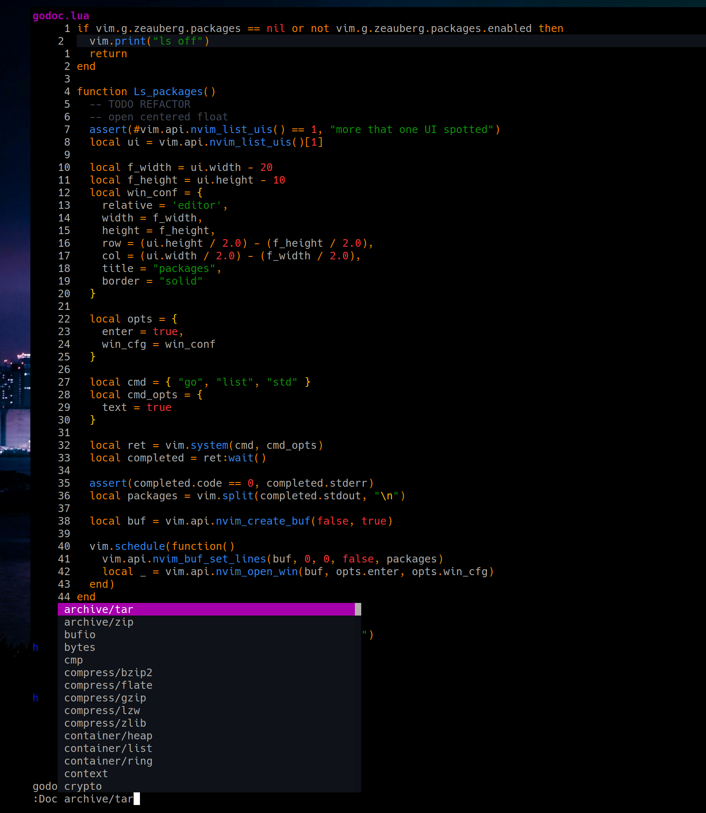
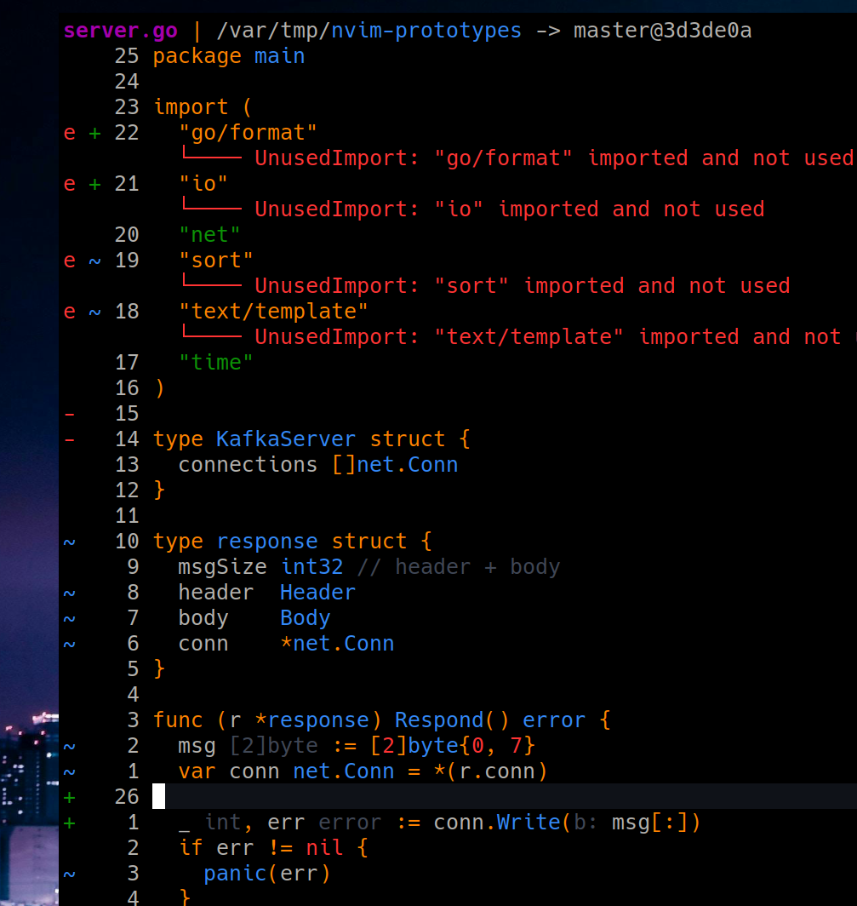
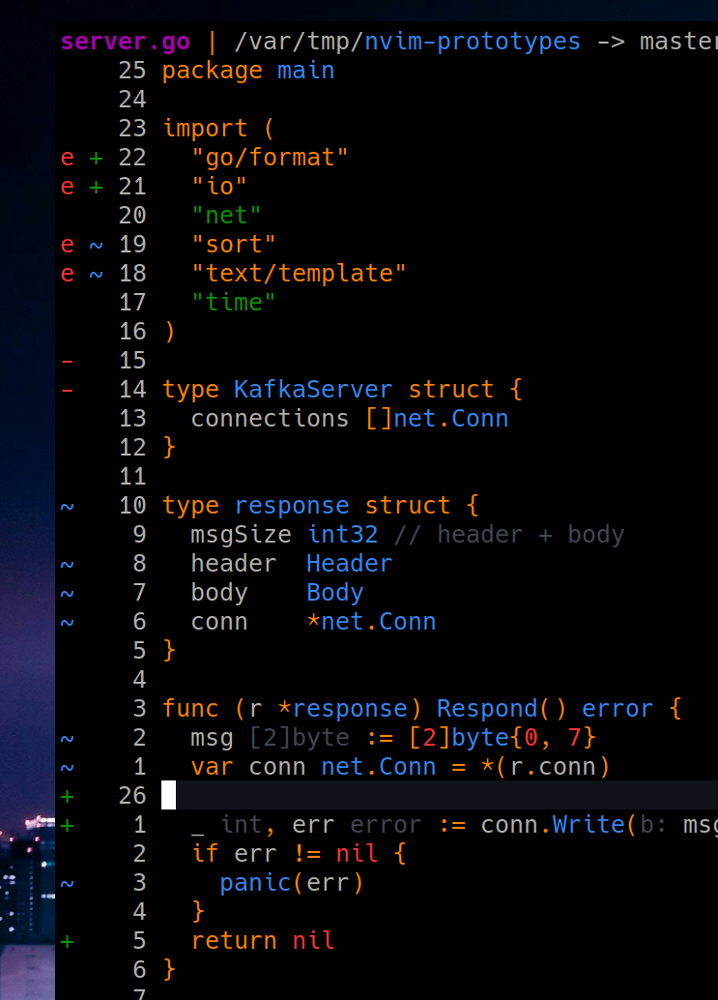
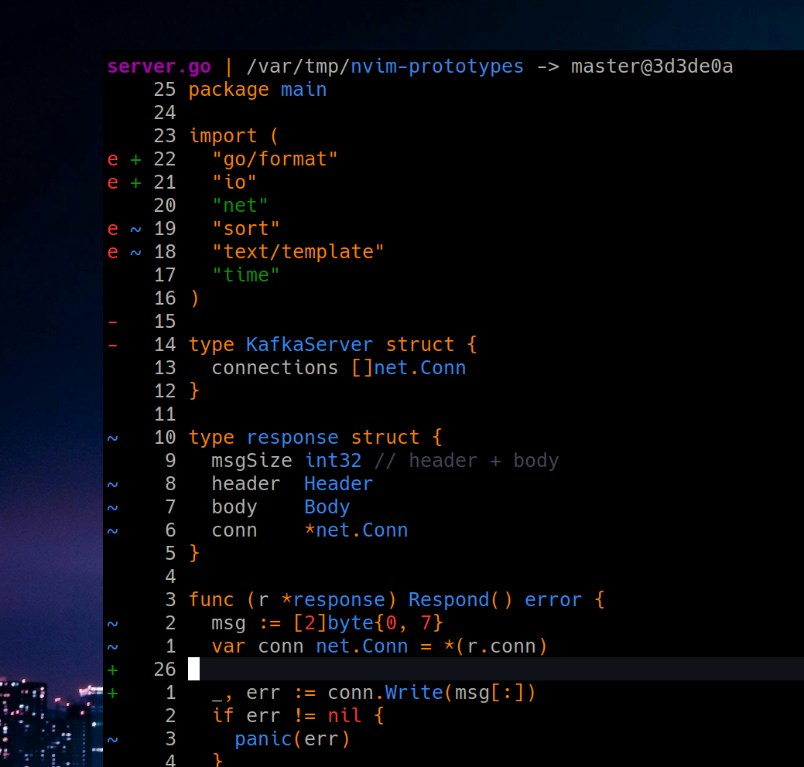

## Feature: `:Doc` vim command

Directory: `./godoc.nvim`

Implementation of the `:Doc` vim command, which allows to render a list of `go packages` in the floating window. It supports completion (currently stub of the same list).

## Feature: toggle diagnostic on demand

File: `./toggle/lua/toggle_diagnostic.lua` implements toggle diagnostics command. It caches user diagnostic config, so it can restore it's state. It is mostly useful as a keyboard shortcut.

All diagnostics + inline hint text turned on:

Diagnostics turned off, but inline hint text turned on.

Both off:

## Feature: `:Ls` vim command

Directory: `./ls`

This one is super useful. It allows to redirect vim command output to the scratch buffer. For example: `:Ls :highlight` to see and modify available highlight groups.
